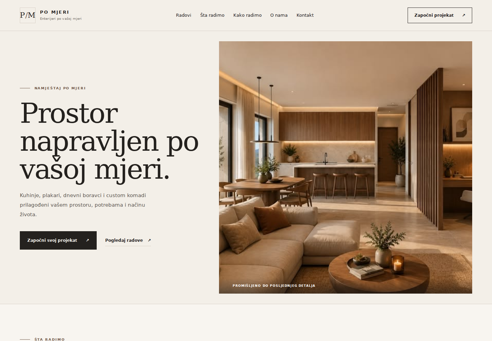
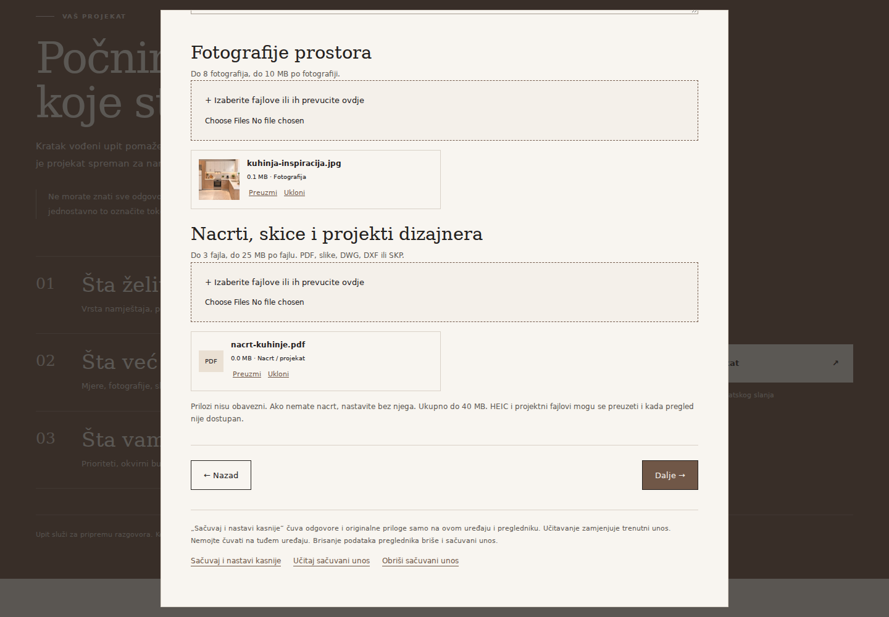
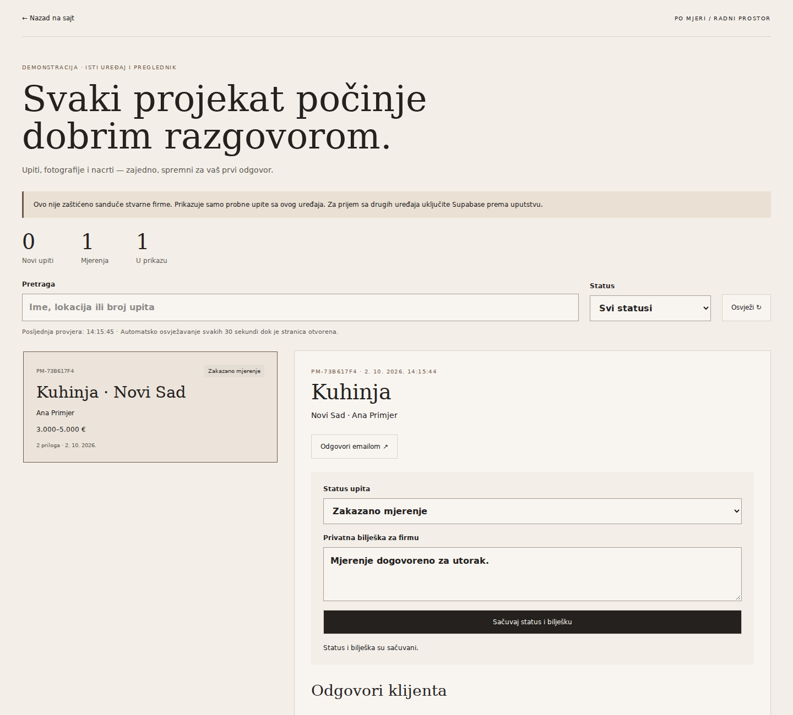

# Namještaj po mjeri

Web projekat koji pomaže klijentu da objasni šta želi, a stolaru da na jednom mjestu dobije podatke za prvi razgovor i okvirnu procjenu.

Klijent bira vrstu namještaja, opisuje prostor, dodaje fotografije i nacrte, označava potrebne usluge i navodi budžet i rok. Stolar u svom sandučetu vidi cijeli upit, kontakt i priloge, prati status i zapisuje dogovor.

## Kako izgleda

### Početna stranica

Predstavljanje usluga, odabranih radova, materijala i procesa saradnje, sa pozivom da klijent opiše svoj projekat.



### Formular sa fotografijama i nacrtima

Upitnik vodi klijenta kroz projekat, detalje, usluge i kontakt. Može priložiti postojeći projekat dizajnera i sačuvati nedovršen unos za kasnije.



### Radni prostor stolara

Lista upita, statusi i detalji izabranog projekta. Fotografije i dokumenti ostaju vezani za odgovarajući upit.



*Snimci prikazuju stvarni interfejs u lokalnom demo režimu. Ime i kontakt u primjeru su izmišljeni; fotografija uz probni upit služi kao ilustracija.*

## Problem koji projekat rješava

Prvi razgovor o namještaju po mjeri često počinje nepotpunim informacijama: nedostaju dimenzije, fotografije, okvirni budžet ili jasan spisak usluga. Podaci i prilozi stižu kroz više poruka pa ih firma mora naknadno prikupljati.

Ovaj projekat ih okuplja u jedan pregledan upit. Namjera je da priprema ponude bude jednostavnija, a prvi razgovor konkretniji. Formular ne zamjenjuje stručnu procjenu i završno mjerenje; konačnu cijenu potvrđuje stolar.

## Šta je uključeno

- Izbor namještaja i objekta: stan, kuća, poslovni prostor ili drugo.
- Dimenzije, materijali, reference, budžet i željeni rok.
- Višestruki izbor usluga, uključujući demontažu, prijevoz i montažu kada su dostupni za izabrani projekat.
- Sprat, lift, pristup za dostavu, opcionalna adresa i kontakt.
- Fotografije prostora i nacrti, skice ili projekti dizajnera.
- Pregled prije slanja i dugme „Pošalji upit i zatraži procjenu“ u povezanom režimu.
- Čuvanje nedovršenog unosa zajedno s prilozima na istom uređaju i u istom pregledniku.
- Sanduče sa pretragom, filterima, statusima, privatnim bilješkama i prilozima.

| Prilozi | Formati | Ograničenje |
| --- | --- | --- |
| Fotografije | JPG/JPEG, PNG, WEBP, HEIC/HEIF | Do 8 fajlova, do 10 MB po fajlu |
| Nacrti i projekti | PDF, DWG, DXF, SKP i navedeni formati slika | Do 3 fajla, do 25 MB po fajlu |

Svi prilozi zajedno mogu imati do 40 MB. Podržane slike imaju pregled; CAD i 3D fajlovi preuzimaju se za otvaranje u odgovarajućem programu.

## Isprobavanje na računaru

Preporučeno okruženje: Node.js 24 i npm.

```bash
npm ci
npm run dev
```

Otvorite adresu koju Vite ispiše u terminalu. Bez lokalne konfiguracije aplikacija radi u demo režimu: popunite formular, dodajte priloge i pošaljite probni upit. Sanduče otvarate preko linka **Ulaz za stolara** na dnu sajta ili dodavanjem `#/upiti` na adresu.

Demo čuva podatke u pregledniku. Nema prijavu i ne prima upite s drugih uređaja. Za lokalno isprobavanje koristite izmišljene podatke.

Ako već imate `.env.local` povezan sa svojim projektom, sačuvajte ga pri zamjeni fajlova. Da biste privremeno prešli na demo, postavite `VITE_DATA_MODE=demo` i ponovo pokrenite razvojni server.

## Povezani režim

Aplikacija podržava Supabase prijavu zaposlenih, bazu upita, privatne priloge i serversku funkciju za prijem formulara. Jedan Supabase projekat predstavlja jednu firmu. Ulaz zaposlenima odobrava administrator preko tabele `staff`.

Uputstvo za početno povezivanje je u [POVEZIVANJE-SUPABASE.md](POVEZIVANJE-SUPABASE.md). Ako ste već podesili bazu i nalog, te korake ne ponavljajte. Kopirajte `.env.example` u `.env.local` samo ako ga još nemate i unesite vrijednosti svog projekta. Koraci za javnu objavu i potrebne postavke nalaze se u [OBJAVLJIVANJE.md](OBJAVLJIVANJE.md). Priprema podataka za obavještenje o privatnosti nalazi se u [PRIVATNOST-NACRT.md](PRIVATNOST-NACRT.md); taj dokument još treba popuniti stvarnim podacima firme.

GitHub Actions workflow je pripremljen za GitHub Pages. Javna objava i završna provjera slanja na objavljenoj adresi još nisu završene u ovoj verziji paketa.

## Tehnologije i struktura

React, Vite, CSS/Tailwind i Supabase. Demo i sačuvani nedovršeni unosi koriste IndexedDB.

| Folder | Namjena |
| --- | --- |
| `src/components` | Sekcije prezentacionog sajta |
| `src/config` | Tekstovi, ponuda i prilagođavanje sadržaja |
| `src/brief` | Upitnik, prilozi i provjera unosa |
| `src/inbox` | Prijava i sanduče stolara |
| `src/data` | Čuvanje podataka i komunikacija sa servisom |
| `src/assets/images` | Fotografije sajta |
| `supabase` | Baza, pravila pristupa i funkcija za slanje |
| `docs/images` | Screenshotovi za ovaj README |

## Provjera

```bash
npm run build
node --test tests/*.test.js
```

Za ovu verziju prolaze build i postojeći testovi. U Chromiumu su provjereni dodavanje fotografije i PDF-a, čuvanje i ponovno učitavanje unosa s prilozima, probno slanje, otvaranje priloga, čuvanje statusa i bilješke i prikaz na mobilnoj širini. Provjera javnog sajta zahtijeva završenu objavu i podešene servise.

## Trenutna ograničenja

Cijenu određuje firma; automatski obračun nije uključen. Email, SMS i push obavještenja nisu implementirani. Sanduče provjerava nove upite svakih 30 sekundi dok je otvoreno, a povezani režim prikazuje do 200 najnovijih upita. Poslije osvježavanja stranice potrebna je ponovna prijava zaposlenog.

Sačuvani nedovršeni unos ostaje na istom uređaju i ne šalje se stolaru. Rok čuvanja poslatih podataka treba dogovoriti prije javne upotrebe; automatsko brisanje i antivirus skeniranje priloga nisu uključeni.
